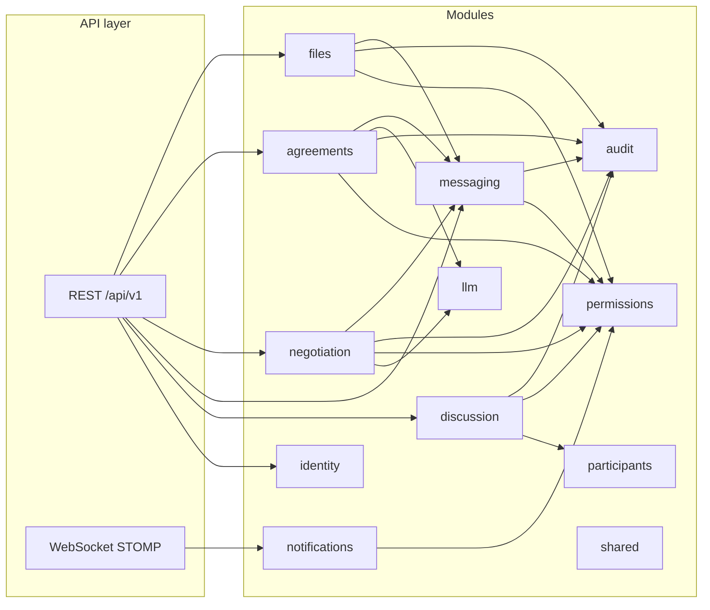
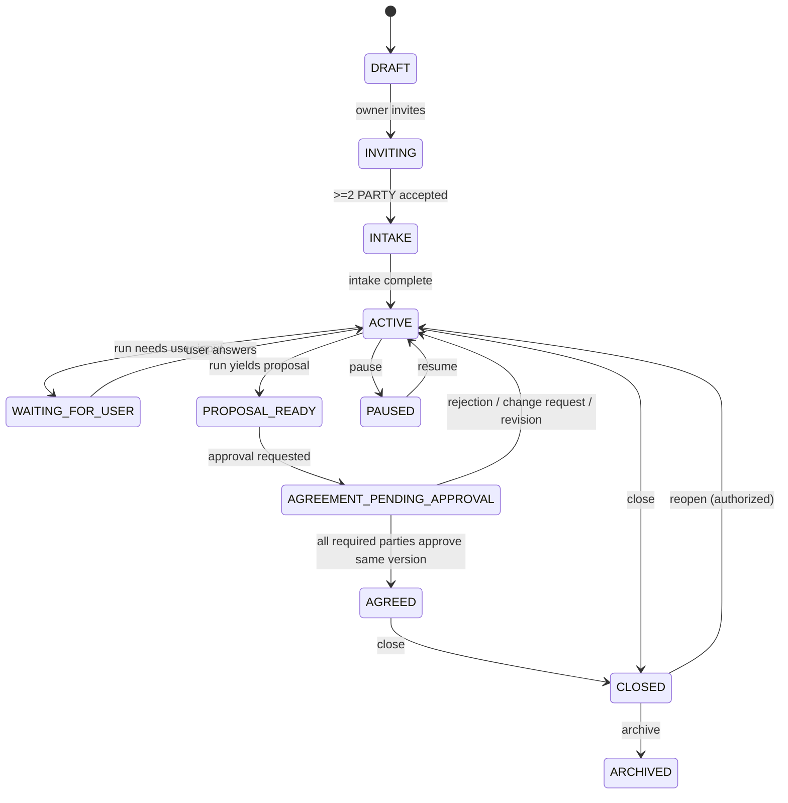
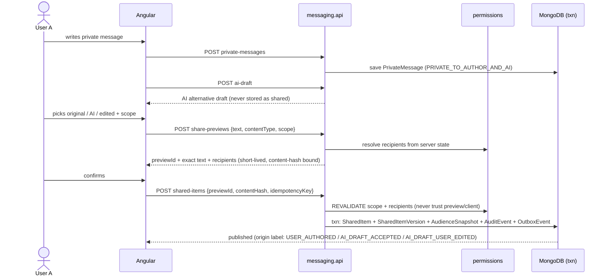
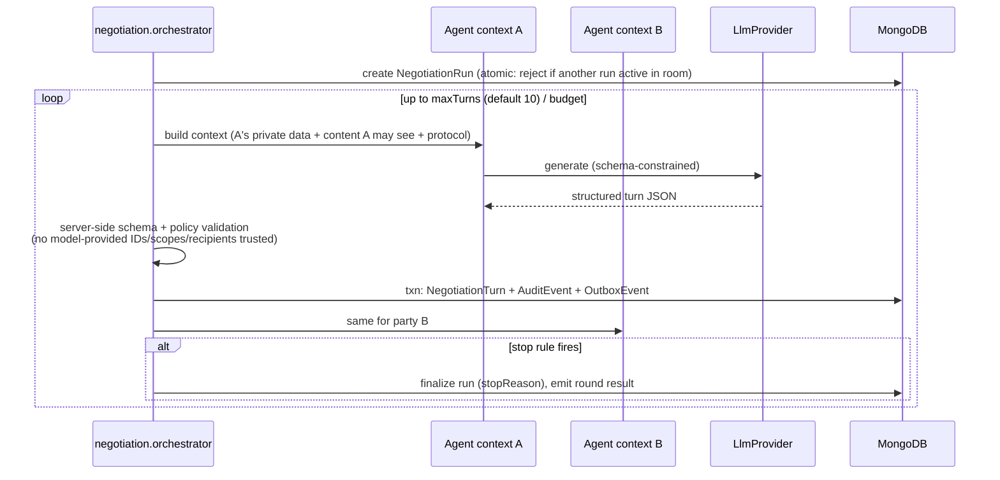

# Architecture — Bridge AI (Trusted AI Negotiation Platform)

Status: **implemented** — all six phases of the MVP defined in [`docs/design-prompt.md`](design-prompt.md)
are built and tested (see [`backlog.md`](backlog.md)); the app is deployed publicly (see
[`deployment.md`](deployment.md)). This document records the architectural decisions and reflects
the delivered state.

---

## 1. Repository state and monorepo plan

The repository currently contains an IntelliJ-generated Gradle/Java placeholder (`build.gradle.kts`,
`settings.gradle.kts`, `src/main/java/com/tufin/Main.java`, Gradle 9.3 wrapper). There is no product code to
preserve, so the repo will be restructured as a monorepo in Phase 1:

```
/
├── backend/          # Kotlin + Spring Boot modular monolith (Gradle module)
├── frontend/         # Angular application (npm workspace, built by Angular CLI)
├── docs/             # Architecture, trust model, security, backlog
├── docker-compose.yml
├── .env.example
├── settings.gradle.kts   # includes :backend
└── README.md
```

The placeholder `Main.java` and its Java plugin configuration will be removed when the `backend` module is
created. The Gradle 9.3 wrapper is kept.

## 2. Technology decisions

| Area | Decision | Rationale |
| --- | --- | --- |
| Language / runtime | Kotlin on **JVM 17** (installed JDK; upgrade path to 21/virtual threads documented) | Spec prefers JVM 21, but the environment provides JDK 17 and the owner approved targeting it. Spring Boot 3.x fully supports 17. |
| Framework | Spring Boot 3.5.x, Gradle Kotlin DSL | Stable, spec-recommended. |
| Web stack | **Spring MVC (servlet)** — not WebFlux | The domain is transactional and Mongo-transaction-heavy; a blocking stack keeps transactions and security simple. Standard servlet thread pool on JVM 17 (virtual threads become a drop-in win after a later JDK 21 upgrade). Kotlin coroutines are used only at the LLM/orchestration edge (`suspend fun generate(...)`), bridged via structured concurrency inside the orchestration service. |
| Data | MongoDB 7.x as a **single-node replica set** in dev/test/CI (required for multi-document transactions); Spring Data MongoDB (imperative, matching MVC) | Spec requires transactions for domain + audit + outbox writes. |
| Migrations | **Mongock** — versioned, idempotent changelogs for index creation and backfills | Spec forbids relying on runtime auto-index creation. |
| Real-time | **Spring WebSocket with STOMP** — clients subscribe to `/topic/rooms/{roomId}`; a `ChannelInterceptor` authorizes every SUBSCRIBE against room membership server-side | STOMP gives per-room subscription semantics and an authorization choke point. SSE is not used in the MVP. |
| Auth | Local JWT mode (access token + rotating refresh token), isolated behind Spring Security so an OIDC provider can replace it later | Spec allows a clearly isolated local JWT mode for development. |
| API | Versioned REST under `/api/v1`, OpenAPI 3 via springdoc | Spec requirement. Frontend client generated from OpenAPI. |
| IDs | **UUIDv7** (time-ordered), stored as strings | Sortable-by-time IDs help timeline queries; single consistent scheme everywhere. |
| Validation | Bean Validation on DTOs; domain invariants enforced in domain services | |
| Testing | JUnit 5, MockK, Testcontainers (Mongo replica set), ArchUnit for module-boundary rules | Spec requirement, incl. negative authorization tests. |
| Observability | Micrometer metrics, structured JSON logging with redaction, correlation IDs | See `security.md`. |
| Frontend | Angular (latest stable), standalone components, signals for local state, RxJS for HTTP/WS, strict TS, SCSS design system, RTL + Hebrew default with i18n-ready English | Spec requirement. E2E via Playwright. |
| LLM | `LlmProvider` abstraction; **OpenAI adapter** as the first real provider (owner decision, 2026-09-13; structured-output JSON-schema mode fits the schema-validated turns); **`FakeLlmProvider` is the default profile** so the full flow runs with no API key | Spec requirement. Anthropic adapter is a later addition behind the same interface. |
| Blockchain | Not used. Append-only `AuditEvent` collection **with hash chaining enabled** | Spec requirement. |

### Assumptions (material, chosen as sensible defaults)

1. The backend toolchain pins Java 17 (installed JDK, owner-approved); JDK 21 + virtual threads is a documented later upgrade.
2. OpenAI is the first real LLM provider (owner decision; model name configurable via env); an Anthropic adapter is a later addition behind the same interface.
3. Invitations produce a single-use link surfaced in-app, and (when enabled) also send a bilingual email through an `EmailSender` port with two implementations: Gmail SMTP (local development) and Brevo HTTPS API (production — hosts like Render block outbound SMTP). Selected via `MAIL_PROVIDER`.
4. Hebrew is the default UI locale; English resources are structured from day one but may lag in copy quality.
5. Single deployment unit (modular monolith), horizontal scale-out is out of scope for the MVP; the outbox worker uses atomic claims so a second instance would not break correctness.

## 3. Modular monolith — bounded modules

One Gradle module (`backend`), boundaries enforced as Kotlin packages under `com.tufin.debate.*` with ArchUnit
rules (a module's `domain`/`application` may not depend on another module's `infrastructure`; only `shared` is
freely importable; cross-module calls go through application services or domain events).



Each module keeps `domain` (entities, value objects, domain services), `application` (use cases, transactions),
`infrastructure` (Mongo repositories, adapters), `api` (controllers, DTOs) sub-packages. `shared` holds IDs,
time, errors, the outbox/idempotency primitives, and domain-event plumbing.

Module responsibilities:

- **identity** — users, registration/login, JWT issuance & refresh rotation.
- **discussion** — `DiscussionRoom` aggregate and its state machine.
- **participants** — participants, invitations (hashed single-use tokens, expiry, revocation), role assignment.
- **permissions** — the single authorization service: role × scope × resource checks used by every other module; audience-snapshot resolution.
- **messaging** — private conversations/messages, AI drafts, share previews, shared items + versions, withdrawal/supersession.
- **negotiation** — negotiation runs, per-party agent contexts, round orchestration, stopping rules, questions/answers.
- **agreements** — proposals, proposal versions, approval requests, approvals, and the three outcome artifacts (AI summary, deterministic approved understandings, AI agreement draft).
- **files** — attachments (≤50MB, allowlisted types) following the message trust model (private → explicit audience share → withdraw-not-delete), behind a `FileStorage` port with local-disk and S3-compatible (AWS S3 / Cloudflare R2 / MinIO) implementations; also backs profile avatars.
- **audit** — append-only hash-chained `AuditEvent` writer + the authorized plain-language timeline and technical audit read models.
- **notifications** — in-app notifications, WebSocket event fan-out (room topics + audience-scoped user queues), per-room presence tracking (online/recently-active, in-memory), and the `EmailSender` port (SMTP / Brevo HTTPS).
- **llm** — `LlmProvider` SPI with the OpenAI adapter (retries, circuit breaker, JSON mode for structured calls) and the deterministic `FakeLlmProvider`; versioned prompt templates (`prompts/{draft,negotiation,summary,agreement}/v1.md`); budgets enforced by the negotiation orchestrator.

## 4. Room state machine



All transitions go through `RoomLifecycleService`, which validates the current state + actor permission with an
atomic conditional update (`status` predicate, `modifiedCount == 1`), emits a domain event, and writes an
`AuditEvent` and `OutboxEvent` in the same Mongo transaction.

## 5. Data model

Collections (one document class per collection; no unbounded embedded arrays in `DiscussionRoom`):

`users`, `discussion_rooms`, `participants`, `invitations`, `role_assignments`, `private_conversations`,
`private_messages`, `shared_items`, `shared_item_versions`, `audience_snapshots`, `proposals`,
`proposal_versions` (terms embedded — bounded), `questions`, `answers`, `ai_agent_profiles`,
`negotiation_runs`, `negotiation_turns`, `approval_requests`, `approvals`, `outcome_artifacts` (+ versions as
immutable docs), `attachment_metadata`, `audit_events`, `notifications`, `outbox_events`, `idempotency_records`.

Conventions:

- UUIDv7 string `_id`; every room-scoped document carries `roomId`; timestamps UTC (`Instant`).
- `schemaVersion` on evolving documents; historical versions are immutable sibling documents, never destructive updates.
- Mutable aggregates (`DiscussionRoom`, `Proposal`, `NegotiationRun`, `OutcomeArtifact`) use `@Version` optimistic locking or status-predicate conditional updates.
- Published content is written as `SharedItemVersion` + `AudienceSnapshot` (frozen list of authorized participant IDs at publication time).

Key indexes (created by Mongock changelogs, all documented there):

| Collection | Index |
| --- | --- |
| discussion_rooms | `{participantsUserIds, status, updatedAt}` (via participants lookup), `{status, updatedAt}` |
| private_messages / shared_items / negotiation_turns / audit_events / notifications | `{roomId, createdAt}` |
| invitations | unique `{tokenHash}`; TTL on `expiresAt` for **pending** tokens only (accepted/revoked invitations are kept for audit) |
| idempotency_records | unique `{roomId, operationType, idempotencyKey}` |
| proposal_versions | unique `{proposalId, version}` |
| outcome artifact versions | unique `{outcomeArtifactId, version}` |
| approvals | unique `{approvalRequestId, participantId}` |
| outbox_events | `{status, nextAttemptAt}` |

Repository rule: no room-scoped fetch by `_id` alone — every query includes `roomId`, and the application layer
runs the permissions check before returning data; projections exclude private fields not needed by the caller.

## 6. Critical flows

### 6.1 Draft → preview → publish (controlled sharing)



If text, content type, or recipients changed after preview, the content hash no longer matches → 409, new
preview required.

### 6.2 Automated AI-to-AI round



Agent contexts are strictly separated: party A's context never contains party B's private data — only content
whose audience snapshot includes A's user. Stop reasons: `MISSING_INFO`, `NEW_CONCESSION`,
`SENSITIVE_DISCLOSURE`, `POSSIBLE_AGREEMENT`, `DEADLOCK`, `MAX_TURNS`, `SAFETY`, plus cost/time budget.

### 6.3 Approval

Approval endpoints are idempotent (idempotency key + unique `{approvalRequestId, participantId}`); an approval
records the exact `proposalVersion` + content hash; any revision creates a new version and invalidates prior
approvals; the room reaches `AGREED` only when every required party approved the **same** version. AI can never
create an `Approval` — the endpoint requires an authenticated human principal.

### 6.4 Transactional outbox

Domain write + `AuditEvent` + `OutboxEvent` commit in one Mongo transaction. A scheduled worker atomically
claims pending events (`findAndModify` on `{status: PENDING, nextAttemptAt <= now}` → `PROCESSING` with lease),
publishes to WebSocket / notifications, marks `PROCESSED`; failures increment `retryCount` with exponential
`nextAttemptAt`, then `DEAD_LETTER`. Consumers are idempotent on `eventId`.

## 7. LLM integration layer

```kotlin
interface LlmProvider {
    suspend fun generate(request: LlmRequest): LlmResponse
}
```

- Adapters: `AnthropicLlmProvider` (real), `FakeLlmProvider` (deterministic scripted responses keyed by scenario — default in `local` profile and all tests).
- API keys only via environment variables; model name configurable.
- Timeouts, exponential backoff with jitter, circuit breaker (resilience4j).
- Token/cost budgets per room and per run enforced by the orchestrator before each call.
- Versioned prompt templates stored as resources (`prompts/{name}/v{n}.md`); template version recorded on each turn.
- Stored per call: provider, model, template version, token counts, cost, latency, correlation ID. **Never** stored: hidden chain-of-thought, raw private prompts in ordinary logs.
- Context minimization: only fields required for the turn are sent; private data is marked and never echoed into `publicMessage` without an explicit share.

## 8. API surface

As specified in the design doc §9: versioned REST under `/api/v1` (auth, rooms/invitations, private assistant,
sharing, negotiation, proposals/approvals, outcomes/timeline/audit) plus STOMP topics per room for the event
types in §10. OpenAPI with request/response examples for the security-critical endpoints (share preview/publish,
approvals, audit). Every event payload carries `eventId, roomId, type, occurredAt, resourceId, resourceVersion`
and no private content beyond the subscriber's authorization.

## 9. Frontend architecture

- Three primary surfaces: **Home**, **Discussion** (single chat-like workspace with `Shared discussion` / `My assistant` switch), **Result** — plus dialogs/bottom sheets for invite, scope selection, exact preview, approve/reject, versions. No permanent dashboard, ≤3 top-level destinations.
- Feature folders mirror backend modules; typed API client generated from OpenAPI; a `RoomEventsService` multiplexes the STOMP stream into signals/RxJS.
- Plain-language UX per design doc §11 (no internal jargon, one primary action, progressive disclosure, RTL/Hebrew default, WCAG 2.2 AA, 320px mobile support). The internal→user-facing wording table from the design doc is the copy source of truth.

## 10. Cross-cutting hardening (Phase 6)

- **Rate limiting** — in-memory fixed windows: per-IP budget on `/api/v1/auth/**`, per-user budget
  on API writes; controlled 429. Single-instance by design (Redis when scaling out).
- **Pagination** — `limit` params (capped at 500) on private messages, shared items, timeline, audit.
- **Single-container hosting** — `Dockerfile.fullstack` bakes the Angular build into the image and
  `SpaConfig` serves it with an index.html fallback (never swallowing `/api`, `/ws`, `/actuator`),
  so UI + API + WebSocket share one origin in production. See [`deployment.md`](deployment.md).
- **Seed data** — `SEED_DEMO=true` (local profile) creates four demo users and a ready discussion.

## 11. Local development & CI

- `docker-compose.yml`: MongoDB single-node replica set (idempotent auto-init via healthcheck script), backend, frontend.
- `.env.example` with placeholder values only; `local` profile defaults to `FakeLlmProvider`.
- Seed data: two demo parties, one observer, one advisor, one demo room.
- Health/readiness endpoints (Spring Actuator) verifying Mongo connectivity.
- CI (GitHub Actions): backend build + all tests (Testcontainers), frontend tests + build, `npm audit`, Syft SBOM artifact. The Playwright E2E for the §17 flow (`frontend/e2e/mvp-flow.spec.ts`) runs locally against the Fake provider (see README).
