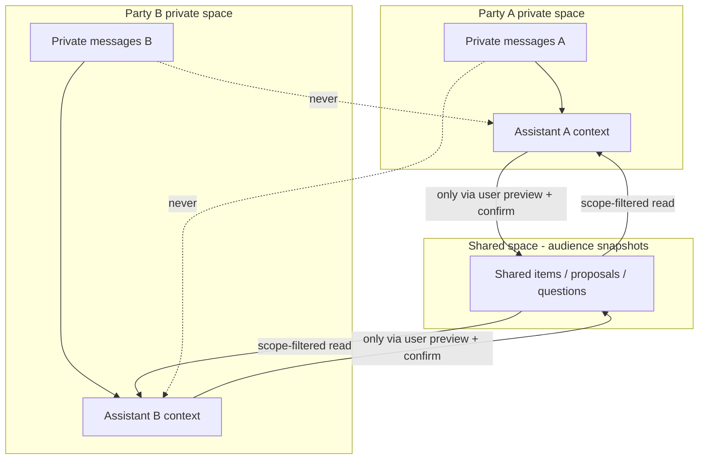

# Trust Model — Bridge AI (Trusted AI Negotiation Platform)

Status: **implemented and test-enforced**. These are **system invariants**: they are enforced server-side,
covered by automated tests (69 backend tests including all 22 acceptance scenarios and a
role×action permission matrix), and may not be weakened for UX or implementation convenience.

---

## 1. Actors

| Actor | Trust level |
| --- | --- |
| User (PARTY) | Authenticated human; the only source of consent, sharing, and approval decisions. |
| OWNER | A PARTY with administrative rights over room settings, invitations, roles. |
| ADVISOR | Authenticated human; sees only scopes explicitly assigned; may comment per permissions. |
| OBSERVER | Authenticated human; read-only over specifically authorized content. |
| Personal AI assistant | **Untrusted proposer.** May draft, analyze, ask, suggest. May not disclose, share, approve, or change permissions. All its output is validated server-side. |
| Other party's assistant / messages / attachments | **Untrusted data** — never instructions (prompt-injection boundary). |
| System | Trusted computing base: authorization service, state machine, audit log, outbox. |

## 2. Invariants and their enforcement

| # | Invariant | Enforcement mechanism | Verified by |
| --- | --- | --- | --- |
| 1 | Private by default | New content defaults to `PRIVATE_TO_AUTHOR_AND_AI`; readers filtered by scope + audience snapshot in the permissions service on every read | Acceptance test 1 |
| 2 | Explicit sharing | Publication requires a prior share-preview and an explicit confirm call bound to it | Tests 2, 4 |
| 3 | Exact preview | Preview returns final text, content type, recipients; confirm carries the preview's content hash; any drift → 409 + new preview | Test 4 |
| 4 | No silent AI actions | AI output is a proposal object only; server resolves all IDs/scopes/recipients from its own state; AI has no principal that can call share/approve/permission endpoints | Tests 8, 11 |
| 5 | Human final approval | `Approval` requires an authenticated human principal; `AGREED` only when every required PARTY approved the identical version (hash-checked) | Tests 11, 12 |
| 6 | Clear provenance | Every item stores `ContentOrigin` (`USER_AUTHORED`, `AI_DRAFT_ACCEPTED`, `AI_DRAFT_USER_EDITED`, `SYSTEM_GENERATED`, `ADVISOR_AUTHORED`); immutable after publication | Test 3 |
| 7 | AI assistance label | Origin `AI_DRAFT_*` renders `AI-assisted wording, approved by {displayName}`; label derived from stored origin, not client input | Test 3 |
| 8 | Immutable shared history | No hard delete of published items; `WITHDRAWN` / `SUPERSEDED` states append events; prior versions retained | Test 5 |
| 9 | Version transparency | Immutable `SharedItemVersion` / `ProposalVersion` documents; per-version diffs; each approval pinned to a version + content hash | Test 13 |
| 10 | No hidden basis for agreement | Private data may enter only the owning user's agent context; structured turn output flags `privateDataReferencedInternally`; server rejects public messages/proposal justifications referencing unshared facts (`sharedFactsUsed` must resolve to items the audience can see) | Tests 8, 9 |
| 11 | Server-side authorization | Single permissions service consulted by every REST endpoint, repository read path, and WebSocket SUBSCRIBE; UI hiding is never a control | Tests 1, 6, 7, 15, 16 |
| 12 | Neutral protocol | Both assistants run the same protocol prompt (versioned); no deception/coercion/pressure instructions; safety stop reason enforced by orchestrator | Test 8 |
| 13 | Explainable process | Every critical action writes an `AuditEvent` (append-only, hash-chained) in the same transaction; human-readable timeline projected from audit + domain events | Test 22 |

## 3. Information-flow model

Rules:

- The only path from a private space into the shared space is the human-confirmed publish flow.
- An assistant's read set = its user's read set (own private space + shared items whose audience snapshot contains the user). Nothing else, ever — including across rooms.
- Audience snapshots are frozen at publication: later role changes never retroactively expand or hide who *could* see an item at that moment.
- Withdrawal narrows future visibility but never erases the historical event.

## 4. Visibility scopes

`PRIVATE_TO_AUTHOR_AND_AI` → `MY_ADVISORS` → `SELECTED_PARTICIPANTS` → `ALL_PARTIES` → `ALL_ROOM_PARTICIPANTS`.

Each published item stores the resolved participant-ID audience snapshot, not just the scope name. Scope
resolution happens server-side at confirm time; client-provided recipient lists are treated as *requested*
input for `SELECTED_PARTICIPANTS` and re-validated against actual room membership.

## 5. AI assistant contract

An assistant **may** receive: its user's private info, shared content its user may see, room objective,
its user's boundaries/flexibility ranges, relevant room history, the neutral protocol.

An assistant **must never**: reveal private info without explicit user approval; invent facts, approvals,
positions, or consent; agree on behalf of its user; present inference as verified fact; threaten, pressure,
deceive, or manipulate; follow instructions embedded in other participants' content; access another room's data.

Enforcement is **not** prompt-only. The orchestrator:

1. Constructs contexts from server state (allow-list, not model choice).
2. Requires schema-validated structured output; free text outside the schema is discarded.
3. Rejects turns whose `sharedFactsUsed` reference unshared items, and stops the run with `SENSITIVE_DISCLOSURE` when progress requires new private data.
4. Applies stopping rules and budgets regardless of model output.
5. Records every turn, prompt-template version, and stop reason in the audit trail.

## 6. Approval integrity

- One `Approval` per `{approvalRequestId, participantId}` (unique index) — idempotent, replay-safe.
- Approval binds `{proposalId, version, contentHash, timestamp, participantId}`.
- Any revision → new version → all prior approvals invalid for the agreement decision.
- Approving an obsolete version returns a controlled conflict, never silent success.
- `Approve` / `Reject` / `Request changes` get fair UI weight; no dark patterns; consequence explained in one sentence before confirmation.

## 7. Audit and explainability

- `audit_events` is append-only: no update/delete API exists; hash chaining (`prevHash`, `eventHash = H(prevHash ‖ canonical(event))`) provides tamper evidence per room.
- Two read models: a plain-language **timeline** for participants (filtered by their authorization) and a technical **audit view** for authorized roles; neither exposes private content beyond the reader's rights.
- Every event carries actor type/ID, action, target, timestamp, audience-snapshot reference, correlation ID, and minimal non-sensitive metadata.

## 8. Files follow the same model

Attachments (images/documents ≤50MB) obey the message invariants: PRIVATE to the uploader by
default; sharing requires an explicit scope choice and freezes an audience snapshot; a shared file
can be **withdrawn** (event kept, history intact) but never hard-deleted; only a still-private
file can be truly deleted. Downloads go exclusively through an authorized endpoint; storage keys
are randomized so the storage layer never sees user filenames; HTML/SVG types are excluded from
the allowlist because browsers execute them.

## 9. Implementation decisions recorded during delivery

- **Invited display name (owner decision):** the inviter provides the invitee's first/last name,
  which becomes that person's display name in the room (their registered name is only a fallback).
  This trades self-controlled identity for onboarding clarity; a "rename me" affordance is a
  candidate follow-up. Accepting your own invitation is rejected without consuming the link.
- **Advisors are room-wide (MVP simplification):** `MY_ADVISORS` resolves to all active advisors
  in the room; per-party advisor assignment awaits the permissions-matrix expansion.
- **Presence is ephemeral UI state:** per-room online/recently-active indicators are held in
  memory, visible to room members only, never persisted and never audited. A "hide my status"
  toggle is a recommended follow-up given the dispute context.
- **Outcome artifacts:** the AI-generated summary and agreement draft are built ONLY from material
  every party can see; the approved-understandings artifact is assembled deterministically (no AI)
  from all-party-approved proposal versions with per-party approval records (name, timestamp,
  version, content hash).

## 10. What the system explicitly does NOT claim

- No legal advice; an in-app approval is not automatically a legally binding contract.
- No qualified electronic signatures in the MVP (authenticated in-app approval + export only).
- No AI arbitration or autonomous final decisions — AI never decides, only humans approve.
